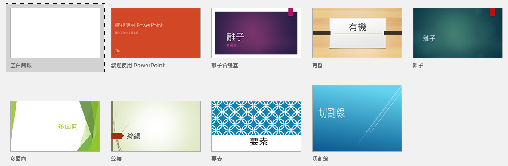
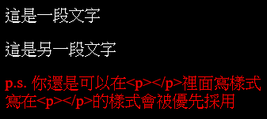
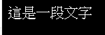
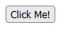
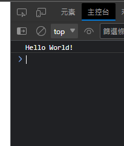
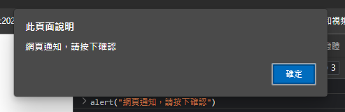
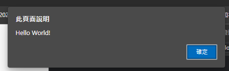
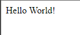
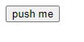
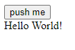

# `HTML` basic II
對，今天要教的是`HTML`  
此講義會接續[HTML basic]的內容，若你是HTML初學者，建議先學習[HTML basic]  
# `Style` 樣式
對，你沒看錯，`Style` again  
我希望字體大小永遠設為`20px`，文字顏色設為`#fff`，並將背景顏色設為`#000`的暗色模式  
以傳統的方法，你需要為每個`<p>`都加上這些`Style`標籤，且如果以後想要改成亮色模式，你需要全部重新設定  
我們需要`模板`  
  
我們可以在`<head></head>`裡加入元素`<style></style>`  
並在`<style></style>`裡面放入預設樣式  
使用方法如下  
> `index.html`  
> ```html
> <!DOCTYPE html>
> <html>
> 	<head>
> 		<style>
> 			tagname_here{
> 				name: value;
> 			}
> 			p{
> 				/*你可以把style放入這裡，所有<p></p>都會套用下面的格式*/
> 				color: #fff;
> 				font-size: 20px;
> 			}
> 			body{
> 				background-color: #000;
> 			}
> 		</style>
> 	</head>
> 
> 	<body>
> 		<p>
> 			這是一段文字
> 		</p>
> 		<p>
> 			這是另一段文字
> 		</p>
> 		<p style="color:#F00;">
> 			p.s. 你還是可以在&lt;p&gt;&lt;/p&gt;裡面寫樣式<br>
> 			寫在&lt;p&gt;&lt;/p&gt;的樣式會被優先採用
> 		</p>
> 	</body>
> </html>
> ```
> `result.png`  
>   

原本你需要為每個`<p></p>`標籤上同樣的`style`標籤，現在，我把它集中到`<style></style>`裡了，code也跟著變簡潔了  
但這份code還可以再更簡潔  
# `CSS` ~~basic~~
~~對，今天要教的是CSS~~  
`CSS`，中文名為階層式樣式表，也就是之前所說的`style`  
格式如下
```css
tagname_here{
	name: value;
}
p{
	/*你可以把style放入這裡，所有<p></p>都會套用下面的格式*/
	color: #fff;
	font-size: 20px;
}
body{
	background-color: #000;
}
```
對，和`<style></style>`使用同樣的語法  
而你可以在`index.html`使用`<link id="style_css" rel="stylesheet" type="text/css" href=".css文件路徑">`來引入`.css`檔  
程式碼解析  
```html
<link 
	rel="stylesheet"    note="表示這東西是style"
	type="text/css"     note="表示這東西的類型text/css"
	href="網址here"     note="css檔案的位置"
>
```
完整範例  
> `style.css`
> ```css
> p{
> 	/*你可以把style放入這裡，所有<p></p>都會套用下面的格式*/
> 	color: #fff;
> 	font-size: 20px;
> }
> body{
> 	background-color: #000;
> }
> ```
> `index.html`
> ```html
> <!DOCTYPE html>
> <html>
> 	<head>
> 		<link id="style_css" rel="stylesheet" type="text/css" href="style.css">
> 	</head>
> 
> 	<body>
> 		<p>
> 			這是一段文字
> 		</p>
> 	</body>
> </html>
> ```
> `result.png`  
> 

# class
但你可能想要把樣式改成A,B,C三個part  
part A文字要用顏色`#f00`  
part B文字要用顏色`#0f0`  
part C文字要用顏色`#00f`  
如果要用css寫，你可能會寫成  
```css
p{
	color:#f00;
}
```
這樣，所有文字顏色都會是`#f00`  
但我想要的是三種顏色  
那就用style硬爆
```html
<p style="color:#f00"></p>
<p style="color:#0f0"></p>
<p style="color:#00f"></p>
```
那如果我part A 有很多段落，意即不只一個`<p></p>`，那可能會這樣爆  
```html
<div style="color:#f00">
	<p></p>
	<p></p>
</div>
<div style="color:#0f0">
	<p></p>
	<p></p>
</div>
<div style="color:#00f">
	<p></p>
	<p></p>
</div>
```
然後如果我突然改變心意，想要改成`#0ff`,`#f0f`和`#ff0`，我需要回到原始碼修改，...  
~~哎呀，css還是比不過style馬~~  
(`ET01`黑不是，會有這種需求的人本身也怪怪的，應該可以算特例把)  
我們使用class來區分  
我們在`<p></p>`裡設定`class`屬性為`(任何值都可以)`  
> `style.css`
> ```css
> .a{
> 	color:#f00;
> }
> .b{
> 	color:#0f0;
> }
> .c{
> 	color:#00f;
> }
> ```
> `index.html`
> ```html
> <p class="a"></p>
> <p class="b"></p>
> <p class="c"></p>
> ```

完成  
你可以用`class`來玩出更多自訂性  
`[student]`老師，剛剛出現的`<div></div>`是甚麼東西  
# div
HTML `<div>` 元素（或是 HTML 文件區塊元素）是本質上不特別代表任何東西的通用内容流容器。它可以成為樣式化用途（使用 class 或 id 屬性）、或是共享如 lang 同一個屬性的元素集合。它應該在沒有其他適合的語義元素（例如`<article>`或 `<nav>` ）可用時才用。  
[來源](https://developer.mozilla.org/zh-TW/docs/Web/HTML/Element/div)  
你可以把`<div></div>`想像成一個看不到的框(你可以設定樣式`border`或`background-color`等等讓它顯示出來)，然後就沒了  
先知道有這個東西就好，待會會用  


# Button
終於回來`HTML`了  
就是字面上的意思，`<button onclick="JS程式碼">東西here</button>`是一個按鈕，`東西here`則代表按鈕裡面的東西，例如按鈕文字，`JS程式碼`代表按鈕按下去後，會執行的JS程式碼  
> ```html
> <button>Click Me!</button>
> ```
> `result.png`  
>   

但這個按鈕按下去不會有任何作用  
我們需要寫程式，按下這個按鈕時，就執行...  
讓我們歡迎`JavaScript`  

# 插播：`HTML`,`CSS`,`JavaScript`分別是什麼
~~(寫個網頁而已，卻一口氣用了3種程式語言，好累)~~  
- `HTML` 整個網頁的核心，負責網頁架構、骨架  
- `CSS` 網頁主題，負責美化網頁  
- `JavaScript` 網頁動態化，負責可互動的項目(如：按鈕)  

# `JavaScript` ~~basic~~
~~對，今天要教的是`JavaScript`~~  
~~講師今天不教`HTML`ㄌ~~

## How to start?
在`HTML`裡新增標籤`<Script></Script>`，你可以在裡面寫`JavaScript`程式碼  
(p.s. `JavaScript`可簡稱`JS`)  
> ```html
> <!DOCTYPE html>
> <html>
> 	<head>
> 
> 		<Script>
>				//將你的JavaScript程式碼寫在這
>			</Script>
> 
> 	</head>
> </html>
> ```

(p.s. 為方便說明，下方程式碼僅保留`JS`部分，`HTML`部分將省略)  
## Hello World! (基本輸出)
如題，我們要寫`Hello World!`  
我們使用`console.log();`來輸出文字  
和ㄈ十十一樣，後面記得加`;`  
所以答案為  
> ```js
> console.log("Hello World!");
> ```
> `result.png`  
>   

如果你沒看到`Hello World!`，那是正常現象  
他會出現在終端機裡面  
按`F12`按鈕，右邊會多出一個開發者介面，並切換到`主控台`(`console`)分頁  
p.s. 不同瀏覽器的介面會稍有不同，這裡以Microsoft Edge做示範  
  
## Hello World! II (彈出提示框)
如題，我們又要寫`Hello World!`  
某些網頁會跳出如下提示框  
  
現在，我們要用這種方式顯示`Hello World!`  
使用`alert();`來顯示通知  
> ```js
> alert("Hello World!");
> ```
> `result.png`  
> 
## Hello World! III (修改網頁顯示內容)
如題，我們双要寫`Hello World!`  
但這次，我們要讓`Hello World!`顯示在頁面上  
為了讓`JavaScript`準確抓到我們想要改的地方，我們要多新增一個屬性`id`  
> ```html
> <div id="你可以隨意決定id的值"></div>
> ```
> `result.png`
>   

記住目前的狀態，現在，我們要用`JS`去修改他  
我們使用`document.getElementById("在這邊輸入id").innerHTML`來修改`<div>`內的元素  
我們來分解這個程式碼  
```js
document//目前的文件(就是index.html)
.getElementById("在這邊輸入id")//使用id查找標籤(會找到<div>...</div>)
.innerHTML//該標籤內的元素(就是<div></div>內的東西)
="Hello World!";//將該標籤內的元素替換成"Hello World!"(就是<div></div>變成<div>Hello World!</div>)
```
完整程式碼如下
> `index.html`
> ```html
> <!DOCTYPE html>
> <html>
> 	<head></head>
> 	<body>
> 		<div id="hi"></div>
> 		<script>
> 			document.getElementById("hi").innerHTML="Hello World!";
> 		</script>
> 	</body>
> </html>
> ```
> `result`
> 

原本空空的網頁，現在多出了個Hello World!  
***請注意，該`JS`程式碼需要放在`<div id="hi"></div>`下面，`JS`才會知道有`<div id="hi"></div>`可以用  
如同你需要先宣告變數`a=0`，`Py`才會知道有`a`這個變數可以用  
## 函數 function
為什麼要建立函數呢？因為我們不想要讓`JS`程式碼和`<button></button>`擠在一起  
函數的建立方法如下  
```js
function 函數名(){
	//在這邊寫code
	return;//你可以在最後面寫return，函數執行完後會回傳該值
}
```
我們希望按下按鈕後，在頁面中顯示`Hello World!`字樣，我們可以這樣寫
> `index.html`
> ```html
> <!DOCTYPE html>
> <html>
> 	<body>
> 		<button onclick="hi()">push me</button><!--按鈕，按下去後，會觸發hi()函數-->
> 		<div id="hi"></div><!--一個div，用來顯示Hhello World!-->
> 		
> 		<script>
> 			//JS程式碼
> 			function hi(){
> 				document.getElementById("hi").innerHTML="Hello World!";
> 			}
> 		</script>
> 	</body>
> </html>
> ```
> `result-before-push-button.png`  
>   
> `result-after-push-button.png`  
>   
## 變數
為什麼要宣告變數？因為變數可以輕鬆儲存我們想存的東西  
類似於ㄈ十十，宣告變數使用  
```js
var 變數名稱(=初始值);
var a=1;
var b=5;
var c=a+b;
```
而我們要輸出變數裡面的東西，如下(記得，沒有`"`);
> `.js`
> ```js
> var a=1;
> console.log(a);
> ```
> result.png
> 

p.s. 你可以在主控台最下方輸入`JS`程式碼，結果會即時顯示  
要把變數顯示在網頁上、提示框也可以，同樣不用加`"`(因為`"text"`代表裡面是字串，`text`代表變數)  
> `.js`
> ```js
> var a=1;
> console.log(a);
> document.getElementById("a").innerHTML=a;
> alert(a);
> ```
> `result_1.png`
> 
> `result_2.png`
> 
> `result_3.png`
> 

# 檔案目錄系統
看看這個網頁：  
  
你點`about`之後，會帶你到另一個網頁  
  
難不成我們要為每個網頁都弄一個倉庫？其實並不是  
我們可以在根目錄裡面加一個資料夾，裡面再裝`index.html`，就可以有第二個頁面了  
wait, what is 根目錄？
根目錄：網頁最上層的目錄，以下面的網址為例  
```txt
https://kagariet01.github.io/about
```
它的根目錄就是`https://kagariet01.github.io`，我們可以簡稱`/`  
而`/about`：  
你可以想像你在操作檔案總管  
你目前在根目錄  
然後點進`about`資料夾  


# 參考資料
- [HTML Style CSS](https://www.w3schools.com/html/html_css.asp)

[HTML basic]: ../HTML%20basic/README.md